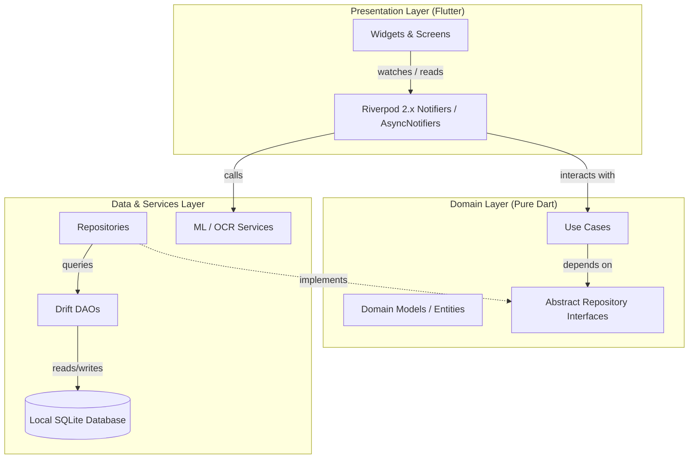

<div align="center">

# ⛩️ Sakuin (索引)
### *Next-Gen Local-First Personal Finance Tracker with Dual Wallet Hierarchy & Natural Language AI*

[](https://flutter.dev)
[](https://dart.dev)
[](https://riverpod.dev)
[](https://drift.simonbinder.eu)
[](LICENSE)
[](#)

<p align="center">
  <a href="#-key-features">Features</a> •
  <a href="#-architecture-system">Architecture</a> •
  <a href="#-smart-input-ai-pipeline">Smart Input AI</a> •
  <a href="#-quick-start">Quick Start</a> •
  <a href="#-documentation">Documentation</a>
</p>

</div>

---

## 💡 What is Sakuin?

**Sakuin (索引)** is a clean, hyper-fast, privacy-first personal finance application tailored for Indonesian financial ecosystems. Built with Flutter, Drift (SQLite), and Riverpod 2.x, Sakuin introduces a structured **Dual-Wallet Hierarchy** and an **Offline Multi-Tier AI Parser** that understands Indonesian slang, shorthands, and receipt OCR instantly.

> 🔒 **100% Local-First & Private**: No mandatory cloud accounts, no third-party tracking. Your financial data stays strictly on your device.

---

## ✨ Key Features

<table>
  <tr>
    <td width="50%">
      <h3>💳 Dual-Wallet Architecture</h3>
      <ul>
        <li><b>Physical Wallet</b>: Track physical cash on hand.</li>
        <li><b>Digital Wallet & Sub-Wallets</b>: Granular tracking for <i>GoPay, OVO, DANA, ShopeePay, Bank Jago, BCA, etc.</i></li>
        <li><b>Atomic Multi-Wallet Transfers</b>: Automated double-entry debits and credits.</li>
      </ul>
    </td>
    <td width="50%">
      <h3>🧠 3-Tier Smart Input Engine</h3>
      <ul>
        <li><b>Indonesian Shorthands</b>: Parses <code>"makan siang 25rb pake gopay"</code>, <code>"1.5jt gaji bca"</code>, <code>"ceban parkir"</code>.</li>
        <li><b>Receipt OCR</b>: Automatic extraction of merchants, totals, and line items.</li>
        <li><b>Adaptive ML Classifier</b>: Offline Naive Bayes + LLM fallback.</li>
      </ul>
    </td>
  </tr>
  <tr>
    <td width="50%">
      <h3>📊 Deep Analytics & Heatmap</h3>
      <ul>
        <li><b>Activity Heatmaps</b>: GitHub-style transaction density visualization.</li>
        <li><b>Real-time Budget Monitoring</b>: Proactive warnings as category limits approach.</li>
        <li><b>Category Breakdown</b>: Interactive charts for cashflow insights.</li>
      </ul>
    </td>
    <td width="50%">
      <h3>⚡ Native System Integrations</h3>
      <ul>
        <li><b>Android Home Widget</b>: Live balance & instant entry launcher on home screen.</li>
        <li><b>App Shortcuts</b>: Long-press launcher for fast Quick Expense recording.</li>
        <li><b>Bilingual Localization</b>: Native Indonesian & English support.</li>
      </ul>
    </td>
  </tr>
</table>

---

## 🏛️ Architecture System

Sakuin strictly adheres to **Clean Architecture** with a **Feature-Driven** layout, ensuring maximum maintainability, testability, and separation of concerns.



<details>
<summary><b>📂 Detailed Directory Structure</b></summary>

```text
lib/
├── core/
│   ├── constants/             # App tokens, default Indonesian categories
│   ├── database/              # Drift DB schema, tables, migrations & DAOs
│   ├── routing/               # Navigation & route management
│   ├── theme/                 # PennywiseAI color schemes & Outfit typography
│   └── utils/                 # Currency formatter (Rp), Result types, extensions
├── features/
│   ├── analytics/             # Expense heatmaps & monthly trend analysis
│   ├── budget/                # Category budgets & threshold tracking
│   ├── categories/            # Category management & icons
│   ├── chat/                  # Offline financial assistant chat
│   ├── home/                  # Dashboard, balance cards & quick input bar
│   ├── onboarding/            # Initial wallet setup wizard
│   ├── settings/              # Currencies, theme mode & database backup
│   ├── transactions/          # Transaction history, detail & CRUD
│   └── wallets/               # Physical / Digital wallet hierarchy
├── services/
│   ├── ml/                    # Indonesian Regex, Naive Bayes & Gemma NLP
│   ├── ocr/                   # ML Kit receipt scanning pipeline
│   ├── shortcuts/             # Native Quick Action shortcuts
│   └── widgets/               # Android Home Widget update service
└── main.dart
```
</details>

---

## 🤖 Smart Input AI Pipeline

The Smart Input system processes natural language text in milliseconds through a hierarchical fallback chain:

```
[ User Input Text ]
        │
        ▼
┌─────────────────────────────────┐
│ Level 1: Indonesian Regex Engine│ ──► Success (95% instant matches: "25rb", "1.5jt", "goceng")
└─────────────────────────────────┘
        │ Fallback
        ▼
┌─────────────────────────────────┐
│ Level 2: Naive Bayes Classifier │ ──► Categorizes context based on past transaction history
└─────────────────────────────────┘
        │ Fallback
        ▼
┌─────────────────────────────────┐
│ Level 3: Gemma Local LLM        │ ──► Complex multi-sentence context parsing
└─────────────────────────────────┘
```

---

## 🚀 Quick Start

### Prerequisites
- [Flutter SDK](https://docs.flutter.dev/get-started/install) (`>= 3.3.0`)
- [Dart SDK](https://dart.dev/get-dart) (`>= 3.3.0`)
- Android Studio / VS Code with Flutter extension

### 1. Clone & Install Dependencies
```bash
git clone https://github.com/NaufalSaputraa/Sakuin.git
cd Sakuin
flutter pub get
```

### 2. Generate Drift Database Code
```bash
dart run build_runner build --delete-conflicting-outputs
```

### 3. Run the App
```bash
flutter run
```

### 4. Run Test Suite
```bash
flutter test
```

---

## 📖 Documentation

Comprehensive architecture, design specifications, and security practices can be found in [`/docs`](docs/):

| Document | Description |
| :--- | :--- |
| 📐 [**Architecture Guide**](docs/ARCHITECTURE.md) | In-depth Clean Architecture, DAO pattern, and Riverpod lifecycle rules |
| 📋 [**Product Requirements (PRD)**](docs/PRD.md) | Feature matrix, user personas, and Indonesian fintech context |
| 🎨 [**Design System**](docs/DESIGN.md) | PennywiseAI design tokens, color palettes, and motion guidelines |
| 🛡️ [**Security & Privacy**](docs/SECURITY.md) | Local SQLite encryption, data validation, and zero-leakage policies |
| 🧪 [**Testing Strategy**](docs/TESTING.md) | Unit tests, DAO integration tests, and parser test suites |
| 🚀 [**Deployment Guide**](docs/DEPLOYMENT.md) | Release signing, Proguard rules, and CI/CD deployment instructions |

---

## 🤝 Contributing

Contributions, issues, and feature requests are welcome!
Feel free to check [issues page](https://github.com/NaufalSaputraa/Sakuin/issues).

---

## 📄 License

Distributed under the MIT License. See `LICENSE` for more information.

<div align="center">
  <sub>Built with ❤️ for Indonesian personal finance management.</sub>
</div>
