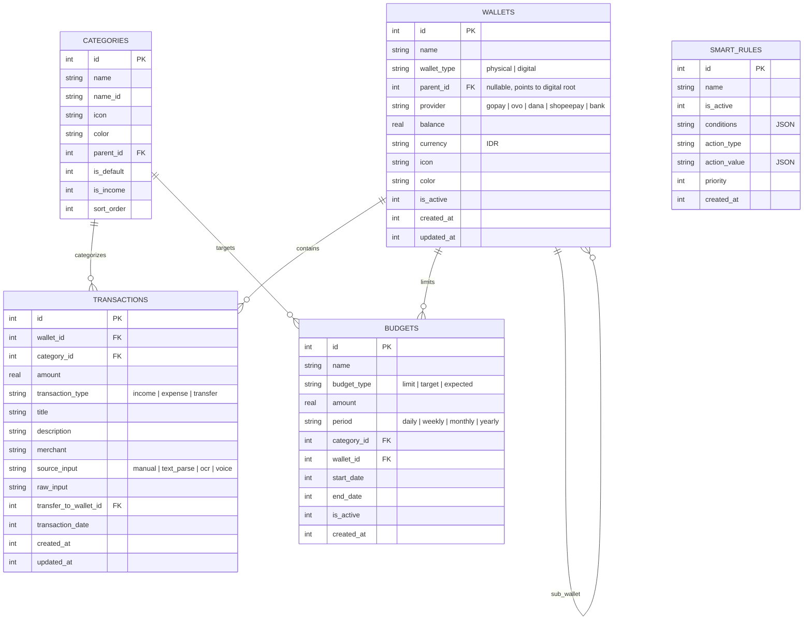

# Sakuin (索引) — Architecture Design Document

> Clean Architecture, Riverpod 2.x, Drift Database, Local-first AI Engine.

---

## 1. System Architecture Overview

Sakuin follows **Clean Architecture** with strict layer separation and single-direction dependency flow.

```
┌─────────────────────────────────────────────────────────────┐
│                      Presentation Layer                     │
│  (Screens, Custom Widgets, Bottom Sheets, State Consumers)  │
└──────────────────────────────┬──────────────────────────────┘
                               │ watches / reads
                               ▼
┌─────────────────────────────────────────────────────────────┐
│                       Providers Layer                       │
│        (Riverpod 2.x Notifier / AsyncNotifier / Stream)     │
└──────────────┬──────────────────────────────┬───────────────┘
               │ calls                        │ calls
               ▼                              ▼
┌──────────────────────────────┐ ┌────────────────────────────┐
│      Domain Layer            │ │      Services Layer        │
│ (Entities, Value Objects,    │ │ (ML Text Parser, NLP,      │
│  Repository Interfaces,      │ │  Voice/OCR Pipeline,       │
│  Result Pattern, Use Cases)  │ │  Import/Export Engines)    │
└──────────────▲───────────────┘ └────────────────────────────┘
               │ implements
               ▼
┌─────────────────────────────────────────────────────────────┐
│                        Data Layer                           │
│ (Drift DB DAOs, Local SQLite Entities, Secure Storage)      │
└─────────────────────────────────────────────────────────────┘
```

### Dependency Inversion Principle
- Presentation never touches Data directly.
- Repositories implement abstract interfaces defined in the Domain layer.
- Providers depend on abstract repository interfaces:
  `Provider<WalletRepositoryInterface>((ref) => WalletRepository(ref.watch(databaseProvider)))`.

---

## 2. Directory Structure

```
lib/
├── core/
│   ├── constants/
│   │   ├── app_constants.dart
│   │   └── category_defaults.dart
│   ├── database/
│   │   ├── app_database.dart
│   │   ├── app_database.g.dart
│   │   └── daos/
│   │       ├── wallet_dao.dart
│   │       ├── transaction_dao.dart
│   │       ├── category_dao.dart
│   │       └── budget_dao.dart
│   ├── l10n/
│   │   ├── app_localizations.dart
│   │   └── locale_keys.dart
│   ├── routing/
│   │   └── app_router.dart
│   ├── theme/
│   │   ├── app_theme.dart
│   │   ├── color_schemes.dart
│   │   └── typography.dart
│   └── utils/
│       ├── currency_formatter.dart
│       ├── result.dart
│       └── extensions.dart
├── features/
│   ├── analytics/
│   │   ├── domain/
│   │   ├── presentation/
│   │   └── providers/
│   ├── budget/
│   │   ├── data/
│   │   ├── domain/
│   │   ├── presentation/
│   │   └── providers/
│   ├── categories/
│   │   ├── data/
│   │   ├── domain/
│   │   └── providers/
│   ├── home/
│   │   └── presentation/
│   ├── transactions/
│   │   ├── data/
│   │   ├── domain/
│   │   ├── presentation/
│   │   ├── providers/
│   │   └── services/
│   └── wallets/
│       ├── data/
│       ├── domain/
│       ├── presentation/
│       └── providers/
└── services/
    └── ml/
        ├── indonesian_regex_parser.dart
        ├── naive_bayes_classifier.dart
        ├── tflite_nlp_service.dart
        └── text_parser_orchestrator.dart
```

---

## 3. Database Schema Design (Drift / SQLite)

### ER Diagram



---

## 4. Multi-Level On-Device AI Pipeline

```
                       User Input Text
                              │
                              ▼
               ┌──────────────────────────────┐
               │ Level 1: Indonesian Regex    │
               │ (Amount: 25rb, 1.5jt, 500k;  │
               │  Keywords: beli, gopay, ovo) │
               └──────────────┬───────────────┘
                              │ High confidence match?
                      ┌───────┴───────┐
                      │ Yes           │ No / Partial
                      ▼               ▼
         ┌─────────────────┐ ┌──────────────────────────────┐
         │ Return ParsedTx │ │ Level 2: Naive Bayes NLP     │
         └─────────────────┘ │ (Category token matches)     │
                             └──────────────┬───────────────┘
                                            │ High confidence?
                                    ┌───────┴───────┐
                                    │ Yes           │ No
                                    ▼               ▼
                       ┌─────────────────┐ ┌──────────────────────────────┐
                       │ Return ParsedTx │ │ Level 3: TFLite Classifier   │
                       └─────────────────┘ │ (On-device embeddings & NER) │
                                           └──────────────┬───────────────┘
                                                          ▼
                                           ┌──────────────────────────────┐
                                           │ Return ParsedTransaction     │
                                           │ (Fallback to Manual Review)  │
                                           └──────────────────────────────┘
```

---

## 5. State Management & Data Flow

1. **Reactive Streams**: Drift DAOs emit `Stream<List<T>>` for real-time reactivity without manual polling.
2. **Riverpod Providers**:
   - `StreamProvider` / `NotifierProvider` wraps DAO streams.
   - UI consumes state using `ref.watch` in `build()`.
   - Actions triggered via `ref.read(...notifier).method()`.
3. **Transaction Flow**:
   - User types input → `text_parser_orchestrator` computes structured candidate.
   - User reviews / edits in bottom sheet.
   - `TransactionRepository.createTransaction()` executes inside a Drift SQLite transaction, atomically updating balance and logging entry.
